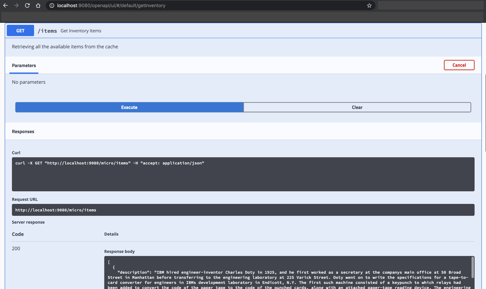

# catalog-ms-openliberty: Openliberty Microservice with Elasticsearch

## Table of Contents

* [Pre-requisites](#pre-requisites)
* [Run Locally](#run-locally)

## Pre-requisites:
* [Appsody](https://appsody.dev/)
    + [Installing on MacOS](https://appsody.dev/docs/installing/macos)
    + [Installing on Windows](https://appsody.dev/docs/installing/windows)
    + [Installing on RHEL](https://appsody.dev/docs/installing/rhel)
    + [Installing on Ubuntu](https://appsody.dev/docs/installing/ubuntu)
For more details on installation, check [this](https://appsody.dev/docs/installing/installing-appsody/) out.

* Docker Desktop
    + [Docker for Mac](https://docs.docker.com/docker-for-mac/)
    + [Docker for Windows](https://docs.docker.com/docker-for-windows/)

* Clone inventory repository:

```bash
git clone https://github.com/ibm-garage-ref-storefront/inventory-ms-openliberty.git
cd inventory-ms-openliberty
```

* Run the MySQL Docker Container

Run the below command to get MySQL running via a Docker container.

```bash
# Start a MySQL Container with a database user, a password, and create a new database
docker run --name inventorymysql \
    -e MYSQL_ROOT_PASSWORD=admin123 \
    -e MYSQL_USER=dbuser \
    -e MYSQL_PASSWORD=password \
    -e MYSQL_DATABASE=inventorydb \
    -p 3306:3306 \
    -d mysql:5.7.14
```

If it is successfully deployed, you will see something like below.

```
$ docker ps
CONTAINER ID        IMAGE               COMMAND                  CREATED             STATUS              PORTS                    NAMES
c082aa55767c        mysql:5.7.14        "docker-entrypoint.s…"   9 seconds ago       Up 9 seconds        0.0.0.0:3306->3306/tcp   inventorymysql
```

* Populate the MySQL Database

Now let us populate the MySQL with data.

- Firstly ssh into the MySQL container.

```
docker exec -it inventorymysql bash
```

* Now, run the below command for table creation.

```
mysql -udbuser -ppassword
```

* This will take you to something like below.

```
root@d88a6e5973de:/# mysql -udbuser -ppassword
mysql: [Warning] Using a password on the command line interface can be insecure.
Welcome to the MySQL monitor.  Commands end with ; or \g.
Your MySQL connection id is 2
Server version: 5.7.14 MySQL Community Server (GPL)

Copyright (c) 2000, 2016, Oracle and/or its affiliates. All rights reserved.

Oracle is a registered trademark of Oracle Corporation and/or its
affiliates. Other names may be trademarks of their respective
owners.

Type 'help;' or '\h' for help. Type '\c' to clear the current input statement.

mysql>
```

* Go to `scripts > mysql_data.sql`. Copy the contents from [mysql_data.sql](https://github.com/ibm-garage-ref-storefront/inventory-ms-openliberty/blob/master/mysql/scripts/load-data.sql) and paste the contents in the console.

* You can exit from the console using `exit`.

```
mysql> exit
Bye
```

* To come out of the container, enter `exit`.

```
root@d88a6e5973de:/# exit
```

* Run the Inventory application as follows.

```
# Build inventory docker image
appsody build

# Run the inventory
docker run --name inventory \
    -e jdbcURL=jdbc:mysql://<docker_host>:3306/inventorydb?useSSL=true \
    -e dbuser=dbuser \
    -e dbpassword=password \
    -p 9091:9080 \
    -d dev.local/inventory-ms-openliberty
```

For instance, if it is `docker-for-mac` it will be `docker.for.mac.localhost`.

* You can also verify it as follows.

```
$ docker ps
CONTAINER ID        IMAGE                                COMMAND                  CREATED             STATUS              PORTS                              NAMES
53cee568be06        dev.local/inventory-ms-openliberty   "/opt/ol/helpers/run…"   10 seconds ago      Up 9 seconds        9443/tcp, 0.0.0.0:9081->9080/tcp   inventory
c082aa55767c        mysql:5.7.14                         "docker-entrypoint.s…"   4 minutes ago       Up 4 minutes        0.0.0.0:3306->3306/tcp             inventorymysql
```

## Run Locally

To run this microservice locally, run the following commands

1. Clone repository:

```
git clone https://github.com/ibm-garage-ref-storefront/catalog-ms-openliberty.git
cd catalog-ms-openliberty
```

2. Set up Elasticsearch container by running the following command:

```
docker run --name catalogelasticsearch \
  -e "discovery.type=single-node" \
  -p 9200:9200 \
  -p 9300:9300 \
  -d docker.elastic.co/elasticsearch/elasticsearch:6.3.2
```

You should have the following output:
```bash
$ docker ps
CONTAINER ID        IMAGE                                                 COMMAND                  CREATED              STATUS              PORTS                                            NAMES
2cd0209be1f4        docker.elastic.co/elasticsearch/elasticsearch:6.3.2   "/usr/local/bin/dock…"   7 seconds ago        Up 6 seconds        0.0.0.0:9200->9200/tcp, 0.0.0.0:9300->9300/tcp   catalogelasticsearch
```

3. Run the application

```
appsody run --docker-options "-e elasticsearch_url=http://<docker_host>:9200 -e elasticsearch_index=micro -e elasticsearch_doc_type=items -e dev.appsody.application.client.InventoryServiceClient/mp-rest/url=http://<docker_host>:9081/micro/inventory -e inventory_health=http://<docker_host>:9081/health"
```

For instance `<docker_host>`, if it is `docker-for-mac` it will be `docker.for.mac.localhost`.

If this runs successfully, you will be able to see the below messages.

```
[Container] [INFO] [AUDIT   ] CWWKT0016I: Web application available (default_host): http://3abf214e654a:9080/micro/
[Container] [INFO] [AUDIT   ] CWWKZ0003I: The application catalog-application updated in 6.546 seconds.
[Container] [INFO] rows loaded
[Container] [INFO] Running it.dev.appsody.application.EndpointTest
[Container] [INFO] Tests run: 1, Failures: 0, Errors: 0, Skipped: 0, Time elapsed: 2.417 s - in it.dev.appsody.application.EndpointTest
[Container] [INFO] Running it.dev.appsody.application.HealthEndpointTest
[Container] [INFO] Tests run: 2, Failures: 0, Errors: 0, Skipped: 0, Time elapsed: 0.372 s - in it.dev.appsody.application.HealthEndpointTest
[Container] [INFO]
[Container] [INFO] Results:
[Container] [INFO]
[Container] [INFO] Tests run: 3, Failures: 0, Errors: 0, Skipped: 0
[Container] [INFO]
[Container] [INFO] Integration tests finished.
[Container] [INFO] Querying Inventory Service for all items ...
[Container] [INFO] rows loaded
```

4. Validate the REST API by visiting the following links:

    - http://localhost:9080/openapi/ui/
    - http://localhost:9080/index.html
    - http://localhost:9080/health
    - http://localhost:9080/openapi

Visit http://localhost:9080/openapi/ui/ and test the rest end point `/items`
as shown below:

